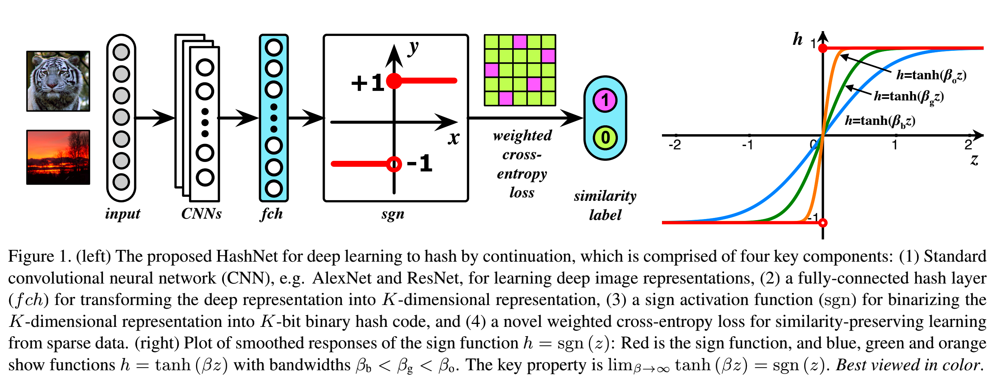

# Implementation of HashNet(ICCV2017) Based on PaddlePaddle

This is an unofficial repo based on PaddlePaddle of ICCV2017:
[HashNet: Deep Learning to Hash by Continuation](https://openaccess.thecvf.com/content_ICCV_2017/papers/Cao_HashNet_Deep_Learning_ICCV_2017_paper.pdf)

English | [简体中文](./README.md)

   * [paddle_hashnet](#Implementation-of-HashNet(ICCV2017)-Based-on-PaddlePaddle)
      * [1 Introduction](#1-introduction)
      * [2 Accuracy](#2-accuracy)
      * [3 Dataset](#3-dataset)
      * [4 Environment](#4-environment)
      * [5 Quick Start](#5-quick-start)
         * [step1: git and download](#step1-git-and-download)
         * [step2: change arguments](#step2-change-arguments)
         * [step3: eval](#step3-eval)
         * [step4: train](#step4-train)
         * [step5: predict](#step5-predict)
      * [6 TIPC](#6-tipc)
      * [7 Code Structure and Description](#7-code-structure-and-description)
      * [8 Model info](#8-model-info)
      * [9 Citation](#9-citation)

- Paper：[HashNet: Deep Learning to Hash by Continuation](https://openaccess.thecvf.com/content_ICCV_2017/papers/Cao_HashNet_Deep_Learning_ICCV_2017_paper.pdf).

- Official repo (caffe/PyTorch) [HashNet](https://github.com/thuml/HashNet).

- Unofficial repo (PyTorch) [DeepHash-pytorch](https://github.com/swuxyj/DeepHash-pytorch).

## 1 Introduction

Learning to hash has been widely applied to approximate nearest neighbor search for large-scale multimedia retrieval, due to its computation efficiency and retrieval quality. **Deep learning to hash**, which improves retrieval quality by end-to-end representation learning and hash encoding, has received increasing attention recently. Subject to the ill-posed gradient difficulty in the optimization with sign activations, existing deep learning to hash methods need to first learn continuous representations and then generate binary hash codes in a separated binarization step, which suffer from substantial loss of retrieval quality.
This work presents HashNet, a novel deep architecture for deep learning to hash by continuation method with convergence guarantees, which learns exactly binary hash codes from imbalanced similarity data. The key idea is to attack the ill-posed gradient problem in optimizing deep networks with non-smooth binary activations by continuation method, in which we begin from learning an easier network with smoothed activation function and let it evolve during the training, until it eventually goes back to being the original, difficult to optimize, deep network with the sign activation function.

The algorithm has been summarized in:

<p align="center">

    <h4 align="center"> Algorithm of HashNet</h4>
</p>

## 2 Accuracy

|      | Framework | 16bits | 32bits | 48bits | 64bits|
|  ----  |  ----  |  ----  |  ----  |  ----  |  ----  |
| Paper Results  | PyTorch |**0.622**|**0.682**|**0.715**|  0.727  |
| Reproduce  | PaddlePaddle  |  0.619**|**0.682**|**0.715**|  **0.734**  |

- The results of running 16/32/48/64 bits of this project (based on PaddlePaddle) are listed in the table above, and the model parameters and training logs are placed in the [output](output) folder.
Since the random seed is fixed during training, it is theoretically reproducible.

## 3 Dataset

MS COCO, i.e. [COCO2014](https://cocodataset.org).

- COCO2014 is an image recognition, segmentation, and captioning dataset. It contains 82,783 training images and 40,504 validation images, where each image is labeled by some of the 80 categories.

- After pruning images with no category information, we obtain 12,2218 images by combining the training and validation images. We randomly sample 5,000 images as queries, with the rest images used as the database; furthermore, we randomly sample 10,000 images from the database as training points. Related codes can be seen in [utils/datasets.py](utils/datasets.py) while preprocessed data lists are put in [./data/coco/](./data/coco/).

- **NOTE** that after comparison, the original data lists are marginally different from that in [DeepHash-pytorch](https://github.com/swuxyj/DeepHash-pytorch). However, through elaborate tests, the results do not vary too much no matter which lists are used. This repo chooses the same lists as the original ones.

## 4 Environment

My Environment：

- Python: 3.7.11
- [PaddlePaddle](https://www.paddlepaddle.org.cn/documentation/docs/en/install/index_en.html): 2.2.2
- Hardware: NVIDIA 2080Ti * 2

## 5 Quick start

### step1: git and download

```
git clone https://github.com/hatimwen/paddle_hashnet.git
cd paddle_hashnet
```

- Due to the large size of the trained weights, they are put in BaiduNetdisk ([code: pa1c](https://pan.baidu.com/s/1vQvv6aSuqMcqR3PEqxs91g)).

- **NOTE** that you should rearrange them following [6 Code Structure and Description](#6-code-structure-and-description).

### step2: change arguments

Please change the scripts you want to run in [scripts](./scripts/) according to the practical needs.

### step3: eval

- **Note**：Remember to download weights from [BaiduNetdisk](https://pan.baidu.com/s/1vQvv6aSuqMcqR3PEqxs91g).

- For multi-GPUs pc:

    ```shell
    sh scripts/test_multi_gpu.sh
    ```

- For single-GPU pc:

    ```shell
    sh scripts/test_single_gpu.sh
    ```

### step4: train

- For multi-GPUs pc (it's recommended to use dual GPUS for reproduction):

    ```
    sh scripts/train_multi_gpu.sh
    ```

- For single-GPU pc:

    ```
    sh scripts/train_single_gpu.sh
    ```

### step5: predict

- Since it takes quite a while to encode for the whole database, this repo has put HashNet codes for each bit in `./output/database_code_*.npy`. And it's OK if you delete them accidentally, as the database codes will be saved during the first attempt to run [predict.py](predict.py).

- Take 64 bits as an example，just run：

    ```
    python predict.py \
    --bit 64 \
    --data_path ./datasets/COCO2014/ \
    --img ./resources/COCO_val2014_000000403864.jpg \
    --save_path ./output \
    --show
    ```

<p align="center">

    <h4 align="center">Picture</h4>
</p>

Output Results:

```
----- Pretrained: Load model state from output/weights_64
----- Load code of database from ./output/database_code.npy
----- Predicted Hamm_min: 0.0
----- Found Mateched Pic: ./datasets/COCO2014/val2014/COCO_val2014_000000403864.jpg
----- Save Mateched Pic in: ./output/COCO_val2014_000000403864.jpg
```

Clearly, the output is is in line with expectations.

## 6 TIPC

- TIPC configs for 16/32/48/64 bits are put separately in [test_tipc/configs](test_tipc/configs/). For convenience, [scripts/tipc.sh](scripts/tipc.sh) is a shell script used to run all these scripts.

- Detailed logs running TIPC are put in [test_tipc/output](test_tipc/output/).

- Please refer to [test_tipc/README.md](test_tipc/README.md) for the specific introduction of TIPC.

## 7 Code Structure and Description

```
|-- paddle_hashnet
    |-- data                # dataset lists
        |-- coco                # data lists
            |-- database.txt        # database list
            |-- test.txt            # test list
            |-- train.txt           # training list
        |-- coco_lite           # lite data lists for TIPC
            |-- database.txt        # database list
            |-- test.txt            # test list
            |-- train.txt           # training list
    |-- datasets
        |-- coco_lite           # lite coco dataset for TIPC
            |-- train2014           # training pictures
            |-- val2014             # test pictures
    |-- deploy
        |-- inference_python
            |-- infer.py            # TIPC inference
            |-- README.md           # Intro of TIPC inference
    |-- models
        |-- __init__.py
        |-- alexnet.py          # definition of AlexNet
        |-- hashnet.py          # definition of HashNet
    |-- output              # logs and weights
        |-- test                # test logs
            |-- log_16.txt          # 16bits
            |-- log_32.txt          # 32bits
            |-- log_48.txt          # 48bits
            |-- log_64.txt          # 64bits
        |-- train               # training logs
            |-- log_16.txt          # 16bits
            |-- log_32.txt          # 32bits
            |-- log_48.txt          # 48bits
            |-- log_64.txt          # 64bits
        |-- weights_16.pdparams     # weights for 16bits
        |-- weights_32.pdparams     # weights for 32bits
        |-- weights_48.pdparams     # weights for 48bits
        |-- weights_64.pdparams     # weights for 64bits
        |-- database_code_16.npy    # database code for 16bits
        |-- database_code_32.npy    # database code for 32bits
        |-- database_code_48.npy    # database code for 48bits
        |-- database_code_64.npy    # database code for 64bits
    |-- scripts
        |-- test_multi_gpu.sh   # test script for multi-GPUS pc
        |-- test_single_gpu.sh  # test script for single-GPU pc
        |-- tipc.sh             # TIPC script
        |-- train_multi_gpu.sh  # trainig script for multi-GPUS pc
        |-- train_single_gpu.sh # trainig script for  single-GPU pc
    |-- test_tipc               # TIPC
    |-- utils
        |-- datasets.py         # dataset, dataloader, transforms
        |-- loss.py             # HashNetLoss
        |-- lr_scheduler.py     # scheduler of learning rate
        |-- tools.py            # mAP, set random seed, get database_code
    |-- export_model.py     # code of transferring dynamic models to static ones
    |-- main_multi_gpu.py   # training code for multi-GPUS pc
    |-- main_single_gpu.py  # training code for single-GPU pc
    |-- predict.py          # demo of predicting
    |-- README.md
```

## 8 Model info

| Info | Description |
| --- | --- |
| Author | Hatimwen |
| Email | hatimwen@163.com |
| Date | 2022.04 |
| Version | PaddlePaddle 2.2.2 |
| Field | Deep Hashing |
| Supported Devices | GPU、CPU |
| Download | [Modes(code: pa1c)](https://pan.baidu.com/s/1vQvv6aSuqMcqR3PEqxs91g)  |
| AI Studio | [AI Studio](https://aistudio.baidu.com/aistudio/projectdetail/3964755?shared=1)|
| License | [Apache 2.0 license](LICENCE)|

## 9 Citation

```BibTeX
@inproceedings{cao2017hashnet,
  title={Hashnet: Deep learning to hash by continuation},
  author={Cao, Zhangjie and Long, Mingsheng and Wang, Jianmin and Yu, Philip S},
  booktitle={Proceedings of the IEEE international conference on computer vision},
  pages={5608--5617},
  year={2017}
}
```

- [PaddlePaddle](https://github.com/paddlepaddle/paddle)

Last but not least, thank PaddlePaddle very much for its holding [飞桨论文复现挑战赛（第六期）](https://aistudio.baidu.com/aistudio/competition/detail/205/0/introduction), which helps me learn a lot.
